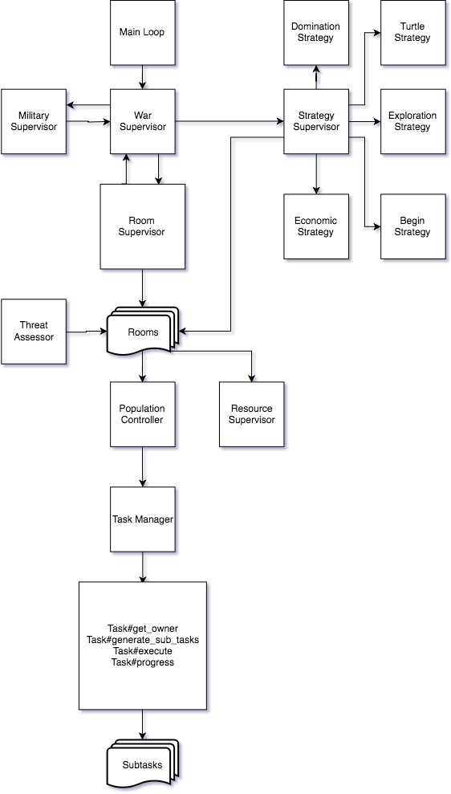

# opal-screeps
My Ruby-based Screeps AI for use with a private server (currently. Eventually I'll port it over to the main world)

# What is Screeps?

https://screeps.com/ - The world's first MMO sandbox game for programmers

# My AI

This is the rough plan of action I'm taking for my own AI. It has drawbacks, and it's changing practically every commit, so we'll see!

# Setup

1. Setup Ruby
1. Setup Opal
1. Setup Compiler + Uploader

_note: I'll flesh this out more later_
